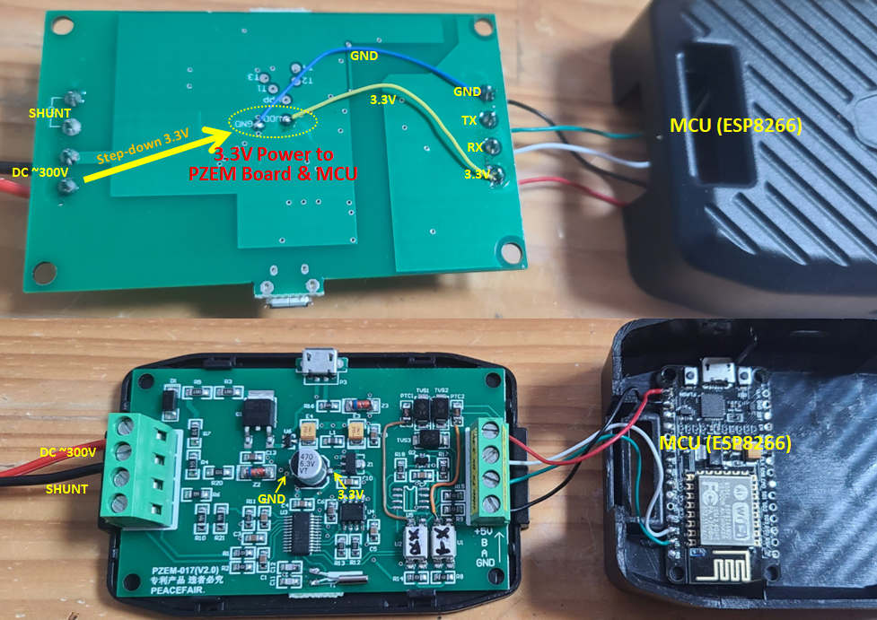

## Easy MOD pzem-017  DC Power Meter

※ 경고 : 개조작업에 따른 책임은 당신에게 있음    ;-)


### pzem-017 board (v2.0)


### 결선하기(Wiring) - without RS485 Module

- RS485칩 제거 및 MCU에 Rx, Tx 직결작업 (3.3V TTL)


- 3.3V 전원 결선 (PZEM보드 및 MCU에 전원 공급)



- 전체모습


-  MCU 고정 및 케이스 조립  - MCU를 뚜껑 안쪽에 밀착시키면 단단히 고정됨


### tasmota 설정


- Main 화면


```
Program Version		13.2.0(tasmota-4M)
Build Date & Time	2023-10-19T09:02:09
Core/SDK Version	2_7_4_9/2.2.2-dev(38a443e)
```


- GPIO 설정
```
D2 GPIO4		PZEM0XX Tx
D1 GPIO5		PZEM017 Rx
```


- EmonCMS서버 연동 설정 (Rule1)

메뉴 : Main Manu - Consoles - Console - (Enter command)

Command :

```
Rule1
ON ENERGY#Voltage DO Var1 %value% ENDON
ON ENERGY#Current DO Var2 %value% ENDON
ON ENERGY#Power DO Var3 %value% ENDON
ON ENERGY#Today DO Var4 %value% ENDON
ON ENERGY#Yesterday DO Var5 %value% ENDON
ON ENERGY#Total DO Var6 %value% ENDON
ON tele-ENERGY DO WEBSEND [my.site.com:80] /emoncms/input/post.json?node=pzem&json={Voltage:%Var1%,Current:%Var2%,Power:%Var3%,Today:%Var4%,Yesterday:%Var5%,Total:%Var4%}&apikey=XXXXXXXXXXXXXXXXXXXXXXXXXXXXXXXX ENDON
Rule1 on
```

- EmonHub Direct Serial 통신 연동설정


```
** /etc/emonhub/emonhub.conf

[interfacers]
  [[SerialDirect]]
     Type = EmonHubSerialInterfacer
      [[[init_settings]]]
           com_port = /dev/ttyUSB0        # or /dev/ttyAMA0 or/dev/ttyACM0 etc
           com_baud = 115200              # to match the baud of the connected device
      [[[runtimesettings]]]
           pubchannels = ToEmonCMS,


[[emonCMS]]
    Type = EmonHubEmoncmsHTTPInterfacer
    [[[init_settings]]]
    [[[runtimesettings]]]
        url = http://localhost/emoncms
        apikey = xxxxxxxxxxxxxxxxxxxxxxxxxxxxxxxx
        pubchannels = ToEmonCMS,           # 모르겠음
        subchannels = ToEmonCMS,           # URL 전송  publish


  [[10]]                                   # NodeID
    nodemane = energymodule
    [[[rx]]]
      #names = Voltage, Current, Power, Today, Yesterday, Total
      names = voltage, current, power1, power2, power3, power4
      datacode = 0
      scales = 1,1,1,1,1,1
      units = V,A,W,W,W,W
```


```
** Tasmota Rule   (NodeID = 10)

<Not Working>
ON tele-ENERGY DO serialsend 10 %Var1% %Var2% %Var3% %Var4% %Var5% %Var6% ENDON


<Working>
ON tele-ENERGY DO serialsend4 10 %Var1% %Var2% %Var3% %Var4% %Var5% %Var6% ENDON
ON tele-ENERGY DO SerialSend3 \r\n ENDON
```


- 전송주기 설정 - Telemetry period (단위: 초, 사용범위: 10~300) - 여기서는 EmonCMS서버로 전송하는 주기임


- EmonCMS 연동상태


- #### pzem-017 set voltage resolution 설정 Command
https://open-boat-projects.org/en/wifi-batteriemonitor/

```
voltres 2			전압값 소수점2자리까지 표시
energyres 0..5			maximum number of decimal places
freqres 0..3 			frequency sensor resolution
voltres 0..3			voltage sensor resolution
```


- #### timezone, ntp서버 설정 Command

```
 Command			설명
 time				현재시각 표시
 timezone +9			KST로 설정(+9시간)
 timezone kst			KST로 설정(+9시간)
 ntpserver 0			설정 Disable
 ntpserver1 time.bora.net	NTP서버1 설정
```
